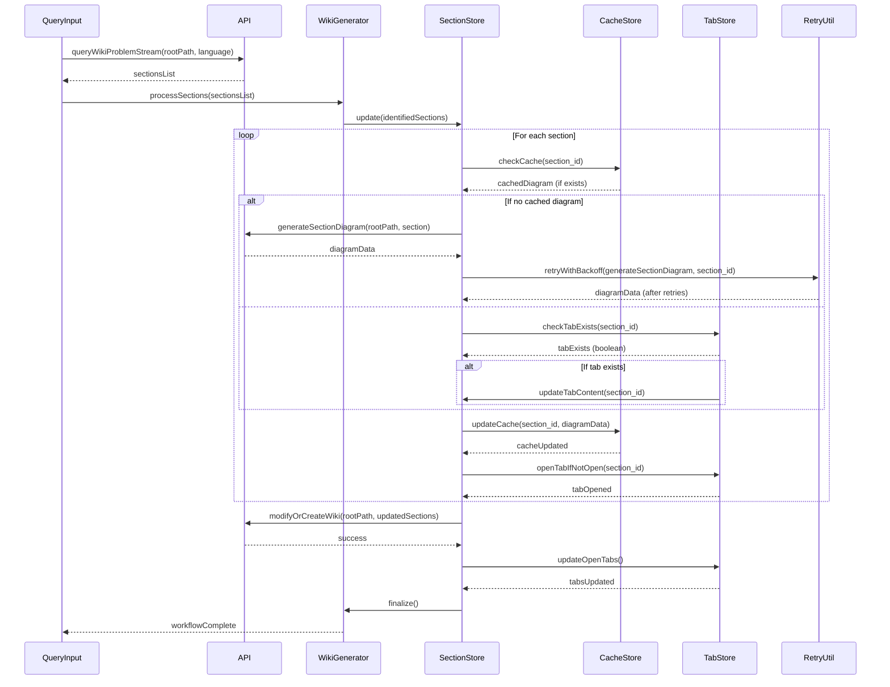
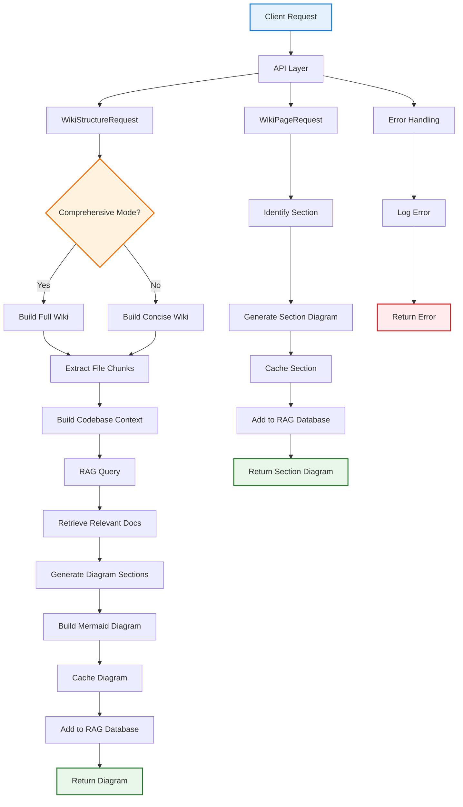
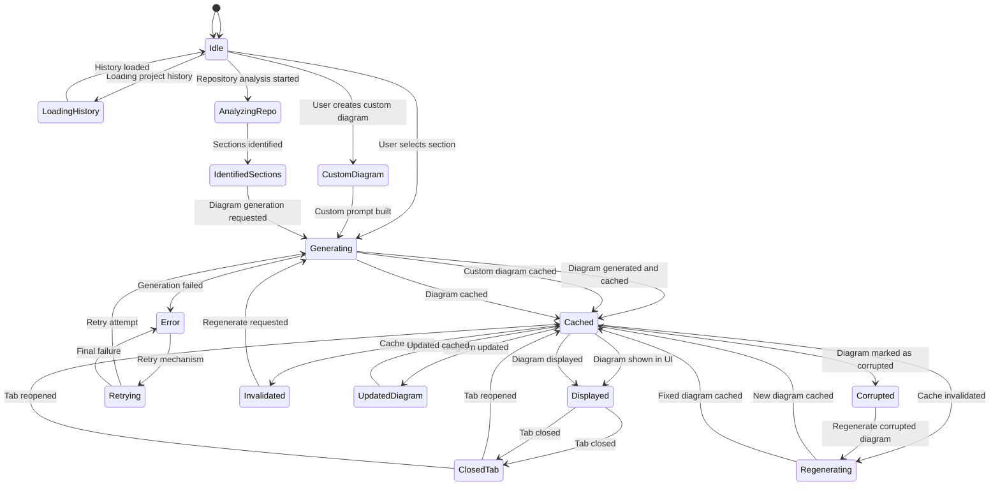

# DiagWiki

## Explaining Code with Interactive Diagrams, no api calls, no privacy concerns!

DiagWiki analyzes your code and generates diagram-based wiki pages that explain how your system works. Instead of reading walls of text, you explore interactive diagrams where you can click on any component to understand its role. 

It is a local deployment tool that leverages large language models (LLMs) running on your machine via [Ollama](https://ollama.ai), ensuring your code never leaves your environment. **So, no expensive API calls or data privacy concerns!**

## Click the image below to watch the demo video:
[](https://youtu.be/NtdctuuEF_8)

## What It Solves

1. Understand complex codebase and present architecture visually with query chat boxes for clarity
2. Generate accurate, detailed diagrams automatically from code for documentation
3. Enable complete control of any step of the diagram generation process - either fully automatic or use instruction & designated files to guide the process.

## Use DiagWiki to visualize this project itself

### API Call Workflow for Diagram Generation (Sequence Diagram)

### Backend Logic Overview (Flowchart)


### UI State Management and Caching (State Diagram)


### Wiki Section Data Structures (Class Diagram)

```mermaid
classDiagram
  class WikiSection {
    +section_id: string
    +section_title: string
    +section_description: string
    +diagram_type: string
    +key_concepts: string[]
  }
  class DiagramData {
    +mermaid_code: string
    +description: string
    +is_valid: boolean
    +diagram_type: string
  }
  class DiagramSection {
    +status: string
    +section_id: string
    +section_title: string
    +diagram_data: DiagramData
  }
  class DiagramSectionsRequest {
    +root_path: string
    +language: string
  }
  class SectionDiagramRequest {
    +root_path: string
    +section_id: string
    +section_title: string
    +section_description: string
    +diagram_type: string
    +key_concepts: string[]
  }
  class WikiDiagramGenerator {
    -root_path: string
    -cache: WikiCache
    -rag: WikiRAG
    +generate_diagram_for_section(section: WikiSection): DiagramData
    +identify_diagram_sections(root_path: string, language: string): List~WikiSection~
  }
  class WikiCache {
    -cache_map: Map~string, DiagramData~
    +get(section_id: string): DiagramData
    +set(section_id: string, data: DiagramData): void
    +is_cached(section_id: string): boolean
  }
  class WikiRAG {
    +call(query: string, top_k: int): Tuple~str, List~Document~~
  }
  class DiagramViewer {
    -diagram_data: DiagramData
    +render(): void
  }
  class LeftPanel {
    -sections: List~WikiSection~
    -diagram_cache: Map~string, DiagramData~
    +update_section_diagrams(): void
  }
  class FolderPicker {
    -folder_path: string
    -sections: List~WikiSection~
    +generate_section_diagram(section: WikiSection): void
  }
  class TreeNode {
    -label: string
    -children: List~TreeNode~
    +expand(): void
  }
  class QueryDialog {
    -query: string
    +submit_query(): void
  }
  class DiagramTabs {
    -tabs: List~DiagramSection~
    +switch_tab(section_id: string): void
  }
  class DiagramStore {
    -diagram_data: Map~string, DiagramData~
    +get(section_id: string): DiagramData
    +set(section_id: string, data: DiagramData): void
  }
  WikiSection o-- DiagramData : contains
  DiagramSection o-- DiagramData : has
  WikiDiagramGenerator --> WikiCache : uses
  WikiDiagramGenerator --> WikiRAG : uses
  LeftPanel o-- WikiSection : displays
  LeftPanel o-- DiagramStore : updates
  FolderPicker o-- WikiSection : generates
  FolderPicker --> DiagramStore : caches
  TreeNode o-- TreeNode : child
  QueryDialog --> WikiRAG : queries
  DiagramTabs o-- DiagramSection : manages
  DiagramViewer --> DiagramData : renders
  DiagramStore o-- DiagramData : stores
  DiagramSectionsRequest --> WikiDiagramGenerator : triggers
  SectionDiagramRequest --> WikiDiagramGenerator : triggers
  note for WikiSection "Represents a section of the wiki with metadata for diagram generation"
  note for DiagramData "Holds the generated Mermaid code and metadata for a diagram"
  note for WikiDiagramGenerator "Main orchestrator for diagram generation and caching"
  note for WikiCache "Caching mechanism to avoid regenerating diagrams"
  note for WikiRAG "Retrieval-Augmented Generation system for context-aware diagram creation"
  note for LeftPanel "Frontend component managing the display of sections and diagrams"
  note for FolderPicker "Component for selecting folders and triggering diagram generation"
  note for DiagramTabs "Component managing open tabs for diagrams"
  note for DiagramViewer "Component responsible for rendering diagrams"
  note for DiagramStore "Svelte store for managing diagram data in frontend"
  note for TreeNode "Frontend component for rendering hierarchical project tree"
  note for QueryDialog "Dialog component for handling user queries"
  note for DiagramSectionsRequest "Request model for identifying diagram sections"
  note for SectionDiagramRequest "Request model for generating a specific diagram section"
```


## How to Start

### Prerequisites

- Python 3.12+
- Node.js 20+
- Ollama running locally
  - Install from [ollama.ai](https://ollama.ai)
  - Pull models: `ollama pull qwen3-coder:30b` and `ollama pull nomic-embed-text` (based on the what you put in .env file)
- Conda (recommended) or pip for Python packages

### Setup

1. **Create environment config**

```bash
cd backend
cp .env.example .env
# Edit .env if needed (defaults work for most setups)
```

2. **Install dependencies**

```bash
# Backend
cd backend
conda env create -f environment.yml
conda activate diagwiki

# Frontend
cd ../frontend
npm install
```

3. **Launch**

```bash
# From project root, in one command:
./launch.sh
```

Or run manually:

```bash
# Terminal 1 - Backend
cd backend
conda activate diagwiki
python main.py

# Terminal 2 - Frontend
cd frontend
npm run dev
```

Access application at `http://localhost:5173` on default.

## Technical Stack

**Why these choices?**

- **Local Ollama + Python**: Privacy-first. Your code never leaves your machine. LLMs run locally without sending data to external APIs.

- **Python + FastAPI**: Fast development for AI/RAG workflows. Direct integration with AdalFlow (RAG framework) and ChromaDB (vector database).

- **Svelte**: Lightweight and fast. Clean component model without virtual DOM overhead. Perfect for interactive diagram rendering with Mermaid.js.

- **Mermaid.js**: Industry-standard diagram syntax. Supports flowcharts, sequence diagrams, class diagrams, state diagrams, and ER diagrams.

**Stack:**
- Backend: Python, FastAPI, AdalFlow (RAG), Ollama (LLM)
- Frontend: SvelteKit, TypeScript, Mermaid.js

## License

See [LICENSE](LICENSE) file.

