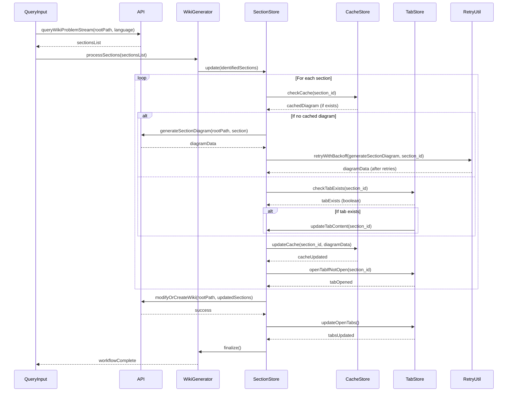
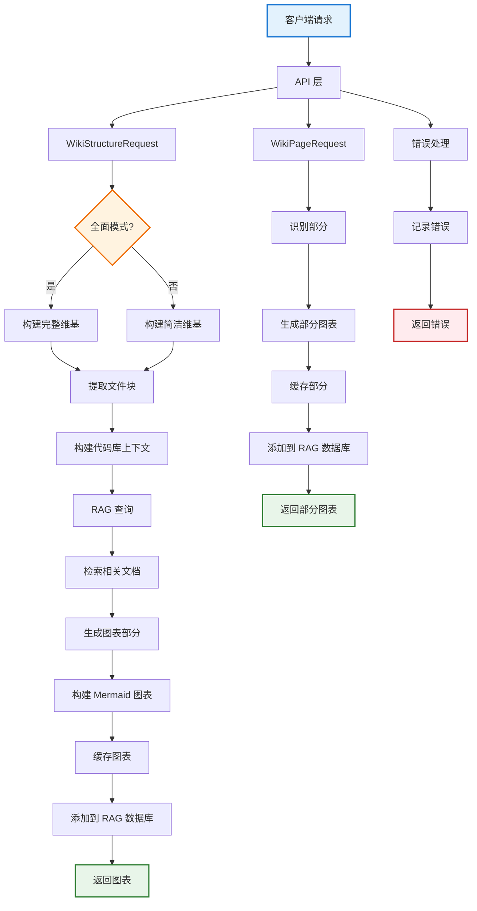
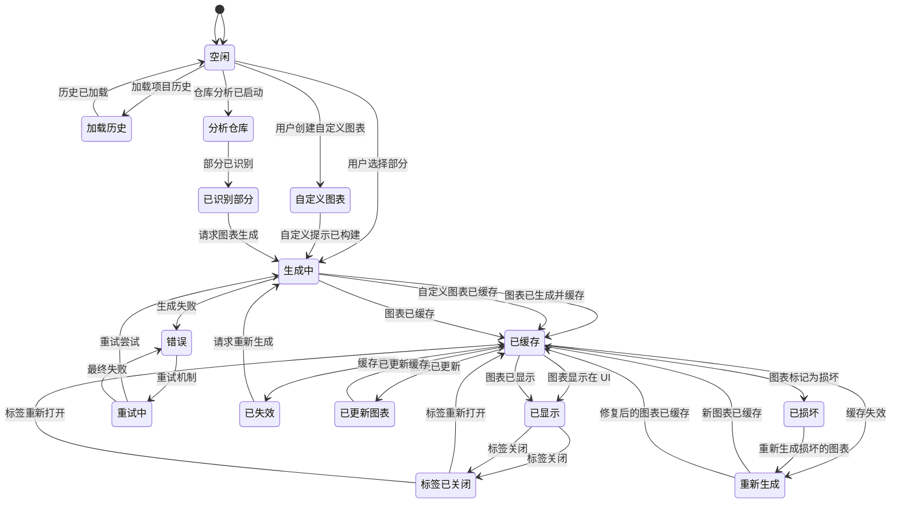

# DiagWiki

## 使用交互式图表解释代码，无需 API 调用，无隐私担忧！

DiagWiki会分析你本地代码并生成基于图表的维基页面，解释系统的工作原理。您无需阅读大段文字，而是探索交互式图表，点击任何组件即可理解其作用。

这是一个本地部署工具，通过 [Ollama](https://ollama.ai) 利用在本地运行的大型语言模型（LLM），确保代码的相对安全。**因此，无需 API 调用产生的费用，也无数据隐私担忧！**

## 点击下方图片观看演示视频：
[](https://www.bilibili.com/video/BV1sZ6RBYEfa/)

## 核心功能 & 试图解决的问题

1. 理解复杂代码库并通过查询聊天框以可视化方式呈现架构，提升清晰度
2. 从代码中自动生成准确、详细的图表用于文档编写
3. 完全控制图表生成过程的每一步 - 既可全自动，也可使用指令和指定文件引导过程

## 使用 DiagWiki 可视化本项目

### 图表生成的 API 调用工作流（序列图）

### 后端逻辑概览（流程图）


### UI 状态管理和缓存（状态图）


### 维基部分数据结构（类图）

```mermaid
classDiagram
  class WikiSection {
    +section_id: string
    +section_title: string
    +section_description: string
    +diagram_type: string
    +key_concepts: string[]
  }
  class DiagramData {
    +mermaid_code: string
    +description: string
    +is_valid: boolean
    +diagram_type: string
  }
  class DiagramSection {
    +status: string
    +section_id: string
    +section_title: string
    +diagram_data: DiagramData
  }
  class DiagramSectionsRequest {
    +root_path: string
    +language: string
  }
  class SectionDiagramRequest {
    +root_path: string
    +section_id: string
    +section_title: string
    +section_description: string
    +diagram_type: string
    +key_concepts: string[]
  }
  class WikiDiagramGenerator {
    -root_path: string
    -cache: WikiCache
    -rag: WikiRAG
    +generate_diagram_for_section(section: WikiSection): DiagramData
    +identify_diagram_sections(root_path: string, language: string): List~WikiSection~
  }
  class WikiCache {
    -cache_map: Map~string, DiagramData~
    +get(section_id: string): DiagramData
    +set(section_id: string, data: DiagramData): void
    +is_cached(section_id: string): boolean
  }
  class WikiRAG {
    +call(query: string, top_k: int): Tuple~str, List~Document~~
  }
  class DiagramViewer {
    -diagram_data: DiagramData
    +render(): void
  }
  class LeftPanel {
    -sections: List~WikiSection~
    -diagram_cache: Map~string, DiagramData~
    +update_section_diagrams(): void
  }
  class FolderPicker {
    -folder_path: string
    -sections: List~WikiSection~
    +generate_section_diagram(section: WikiSection): void
  }
  class TreeNode {
    -label: string
    -children: List~TreeNode~
    +expand(): void
  }
  class QueryDialog {
    -query: string
    +submit_query(): void
  }
  class DiagramTabs {
    -tabs: List~DiagramSection~
    +switch_tab(section_id: string): void
  }
  class DiagramStore {
    -diagram_data: Map~string, DiagramData~
    +get(section_id: string): DiagramData
    +set(section_id: string, data: DiagramData): void
  }
  WikiSection o-- DiagramData : 包含
  DiagramSection o-- DiagramData : 拥有
  WikiDiagramGenerator --> WikiCache : 使用
  WikiDiagramGenerator --> WikiRAG : 使用
  LeftPanel o-- WikiSection : 显示
  LeftPanel o-- DiagramStore : 更新
  FolderPicker o-- WikiSection : 生成
  FolderPicker --> DiagramStore : 缓存
  TreeNode o-- TreeNode : 子节点
  QueryDialog --> WikiRAG : 查询
  DiagramTabs o-- DiagramSection : 管理
  DiagramViewer --> DiagramData : 渲染
  DiagramStore o-- DiagramData : 存储
  DiagramSectionsRequest --> WikiDiagramGenerator : 触发
  SectionDiagramRequest --> WikiDiagramGenerator : 触发
  note for WikiSection "表示维基的一个部分，包含图表生成的元数据"
  note for DiagramData "保存生成的 Mermaid 代码和图表元数据"
  note for WikiDiagramGenerator "图表生成和缓存的主要协调器"
  note for WikiCache "缓存机制，避免重新生成图表"
  note for WikiRAG "检索增强生成系统，用于上下文感知的图表创建"
  note for LeftPanel "管理部分和图表显示的前端组件"
  note for FolderPicker "用于选择文件夹并触发图表生成的组件"
  note for DiagramTabs "管理图表打开标签的组件"
  note for DiagramViewer "负责渲染图表的组件"
  note for DiagramStore "用于在前端管理图表数据的 Svelte store"
  note for TreeNode "用于渲染层级项目树的前端组件"
  note for QueryDialog "处理用户查询的对话框组件"
  note for DiagramSectionsRequest "用于识别图表部分的请求模型"
  note for SectionDiagramRequest "用于生成特定图表部分的请求模型"
```


## Quickstart

### 前置需求

- Python 3.12+
- Node.js 20+
- 本地运行的 Ollama
  - 从 [ollama.ai](https://ollama.ai) 安装
  - 拉取模型：`ollama pull qwen2.5-coder:7b` 和 `ollama pull nomic-embed-text`
- Conda（推荐）或 pip 用于 Python 包管理

### 设置

1. **创建环境配置**

```bash
cd backend
cp .env.example .env
# 如需要可编辑 .env（默认配置适用于大多数设置）
```

2. **安装依赖**

```bash
# 后端
cd backend
conda env create -f environment.yml
conda activate diagwiki

# 前端
cd ../frontend
npm install
```

3. **启动**

```bash
# 从项目根目录，一个命令启动：
./launch.sh
```

或手动运行：

```bash
# 终端 1 - 后端
cd backend
conda activate diagwiki
python main.py

# 终端 2 - 前端
cd frontend
npm run dev
```

前端默认会在 `http://localhost:5173` 

## 技术栈

**为什么选择这些技术？**

- **本地 Ollama + Python**：隐私优先。您的代码永不离开机器。LLM 在本地运行，无需向外部 API 发送数据。

- **Python + FastAPI**：快速开发 AI/RAG 工作流。直接集成 AdalFlow（RAG 框架）和 ChromaDB（向量数据库）。

- **Svelte**：轻量且快速。清晰的组件模型，无虚拟 DOM 开销。完美适配 Mermaid.js 的交互式图表渲染。

- **Mermaid.js**：行业标准图表语法。支持流程图、序列图、类图、状态图和 ER 图。

**技术栈：**
- 后端：Python、FastAPI、AdalFlow（RAG）、Ollama（LLM）
- 前端：SvelteKit、TypeScript、Mermaid.js

## License

查看 [LICENSE](LICENSE) 文件。
